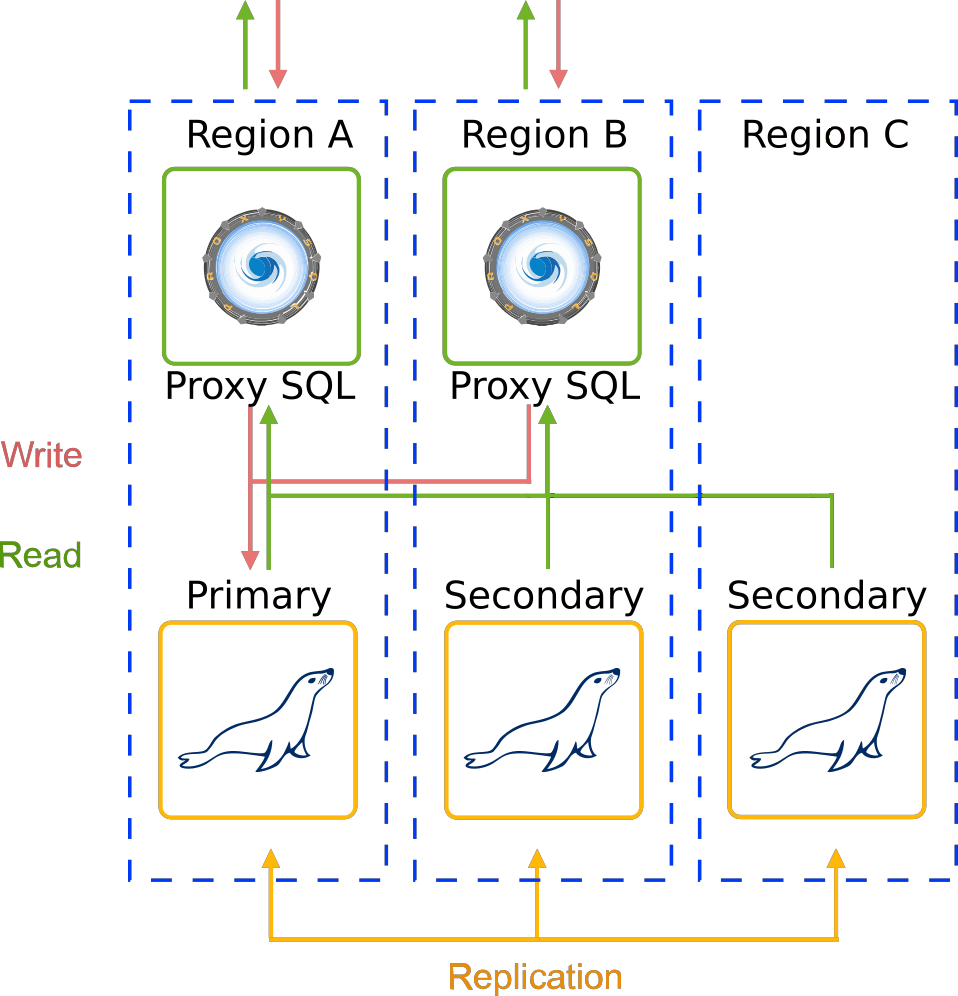
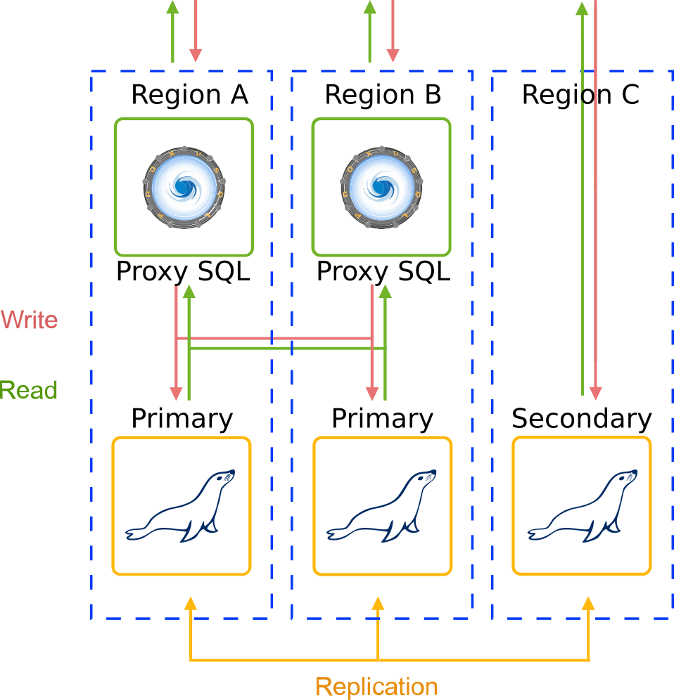
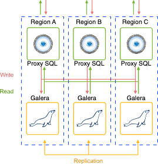
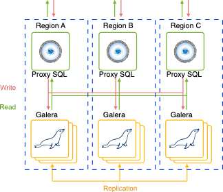
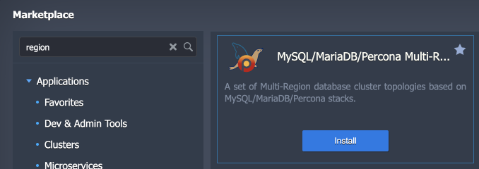
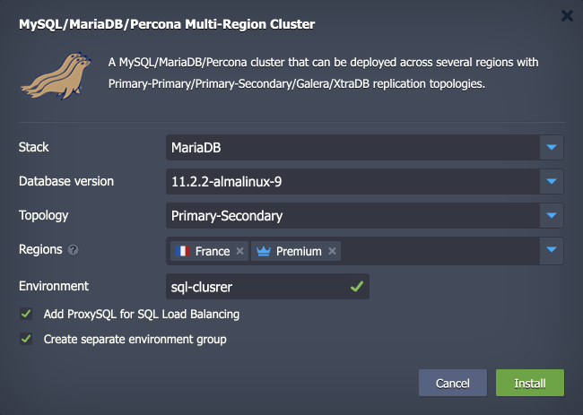
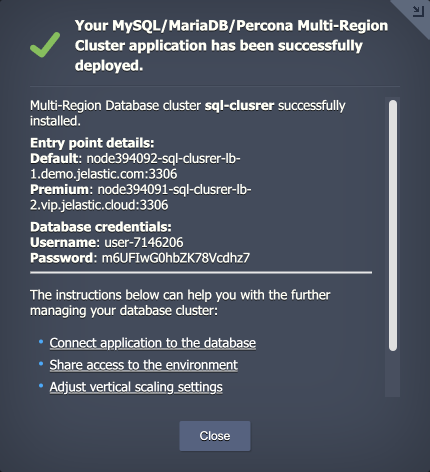

<p align="center">

</p>

# Multi-Region SQL Cluster

This solution creates an advanced, highly available cluster across **several regions** of the Virtuozzo Application Platform. The package allows choosing the preferred database type (software stack) and replication topology to create a solution most suitable to the user needs.

**Supported database stacks:**

- *MySQL*
- *MariaDB*
- *Percona*

**Supported replication topologies:**

- *primary-secondary (source-replica)* - provides a good consistency (i.e., exactly one node to modify data) but no automatic failover upon primary failure. Secondaries can be read without impact on primary.
- *primary-primary (source-source)* - operates with two primary nodes simultaneously, while other instances are configured as secondaries.
- *Galera Cluster (MariaDB only)* - implements a multi-primary synchronous replication which is performed at a transaction commit time, by broadcasting transaction write set to all cluster nodes.
- *XtraDB Cluster (Percona only)* - provides a solution similar to the MariaDB Galera Cluster, offering high availability and scalability.


## High Availability and Failover

Main purpose of Cross-Region DB clusters is high availability and failover capabilities at the data center level. Thus, if one of the regions fails, the database cluster will still be available and will handle Writes and Read queries with no data loss.

**For Primary-Secondary topology,** if a Primary Region becomes unavailable, one of the Secondary Regions will be promoted to Primary and will be able to handle Reads and Writes with no data loss.

**For Primary-Primary topology,** if one of the Primary Region fails, cluster will be available and keep handling Writes and Read queries via the second Primary. In case both Primary Regions become unavailable, the Secondary Region can be used to handle Reads and Writes with no data loss.

**For Galera and XtraDB Cluster topologies,** if one node in the cluster fails, the other nodes continue to operate as usual. When the failed node comes back online, it automatically synchronizes with the other nodes before it is allowed back into the cluster. The same approach is applied for the single region failure, so no data is lost in single node/region failures.


### Primary-Secondary Database Topology

Multi-Region Primary-Secondary database clustering topology provides a single Primary database and as many Secondaries as needed. The data from the Primary database server (previously known as “master”) is replicated to one or more Secondary database servers (previously known as “slaves”). Such implementation ensures high consistency (i.e., exactly one node to modify data), but no automatic failover upon primary failure.

<p align="left">

</p>

The package deploys the Highly Available [ProxySQL Load Balancer](https://www.proxysql.com/) layer in front of the cluster in order to process the incoming requests.

### Primary-Primary Database Topology

Multi-Region Primary-Primary database clustering topology provides an asynchronous replication and ensures data spread across database cluster servers which fits better for the cases when Regions (data centers) are located far away from each other. In such a way the latency influence on transaction commit can be compensated. As for disaster recovery one or more Secondary nodes can be added for the required Cross-Region deployment. Thus, the recommended topology may look like: Primary-Primary-Secondary in case there are three Regions available. Every database server or load balancer node in the cluster topology is created in a separate environment. After creation such environments are combined into Multi-Region cluster.

<p align="left">

</p>

The package deploys the Highly Available [ProxySQL Load Balancer](https://www.proxysql.com/) layer in front of the cluster in order to distribute requests between Primary nodes.

### Galera (XtraDB) Cluster Database Topology

The multi-region **MariaDB Galera** and **Percona XtraDB** clusters consist of node groups deployed into three different regions. Depending on the required level of performance and high availability, you can choose between two topology options based on:

- **MariaDB/Percona standalone per region** – provides a single MariaDB/Percona instance in each of the three regions that form the Galera/XtraDB cluster

<p align="left">

</p>

- **MariaDB Galera/Percona XtraDB cluster per region** – creates Galera/XtraDB cluster (3 nodes) in each region (9 nodes total)

<p align="left">

</p>

Both topologies provide out-of-box high availability and failover capabilities for your database cluster. In case of a cluster node failure, both topologies ensure that the database cluster works without downtime.

Additionally, the package provides a setting to include/exclude highly available [ProxySQL Load Balancer](https://www.proxysql.com/) layer in front of the cluster, which will distribute requests between nodes.


## Installation Process

If you don’t have an account at the Virtuozzo Application Platform, you can click the **Deploy to Cloud** button below. It will redirect you to a widget that will automatically create an account (for the provided email) at the [Virtuozzo Public Cloud Provider](https://www.virtuozzo.com/application-platform-partners/) of your choosing.

[](https://www.virtuozzo.com/install/?manifest=https://raw.githubusercontent.com/jelastic-jps/mysql-multiregion/master/manifest.jps)

If you are already registered, you can deploy this cluster from the [Marketplace](https://www.virtuozzo.com/application-platform-docs/marketplace/).

1\. Find the ***MySQL/MariaDB/Percona Multi-Region Cluster*** application and **Instal**l it.



2\. Provide the following details in the opened installation window:

- **Stack** – select MariaDB, MySQL, or Percona database stack
- **Database Version** – choose the preferred tag version for the selected stack
- **Topology** – choose the multi-region cluster topology (available options depend on the selected stack)
- **Regions** – choose target regions on the platform
- **Add ProxySQL for SQL Load Balancing** – tick to add ProxySQL in front of your cluster
- **Create Separate Environment Group** – tick to automatically add all cluster environments into dedicated [environment group](https://www.virtuozzo.com/application-platform-docs/environment-groups/)
- **Environment** – provide a name that will be used for environments’ naming
- **Display Name** – custom [alias](https://www.virtuozzo.com/application-platform-docs/environment-aliases/) for the environments



3\. Click **Install** and wait for the installation success notification with entry point details and access credentials.



Additionally, you’ll receive emails with the same information.


## Entry Point

The multi-regional database cluster can be accessed from each region. The required entry point can be comprised of the preferred region name and ProxySQL node (if added) or SQL layer:

- with ProxySQL

```
node${ID}-${envName}-lb-{1|2|3}.${regionDomain}:3306
```

- without ProxySQL

```
sqldb.${envName}-db-{1|2|3}.${regionDomain}:3306
```

You can view the exact entry points for your multi-regional database cluster in the after-installation success window and email.


## Summary
This README provides an overview of a multi-region SQL cluster solution using Virtuozzo Application Platform. It explains the supported database stacks and replication topologies, as well as the high availability and failover capabilities of the cluster. The document also describes the primary-secondary, primary-primary, and Galera/XtraDB cluster topologies, along with the deployment of the ProxySQL load balancer layer. The installation process is outlined, including the deployment options and configuration details. Finally, it mentions the entry points for accessing the multi-regional database cluster.