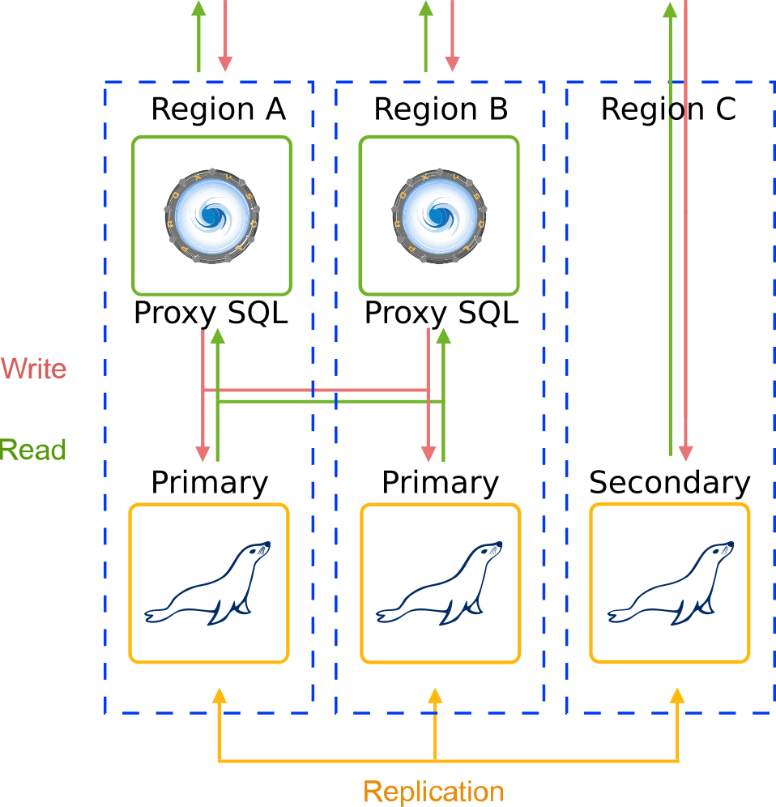
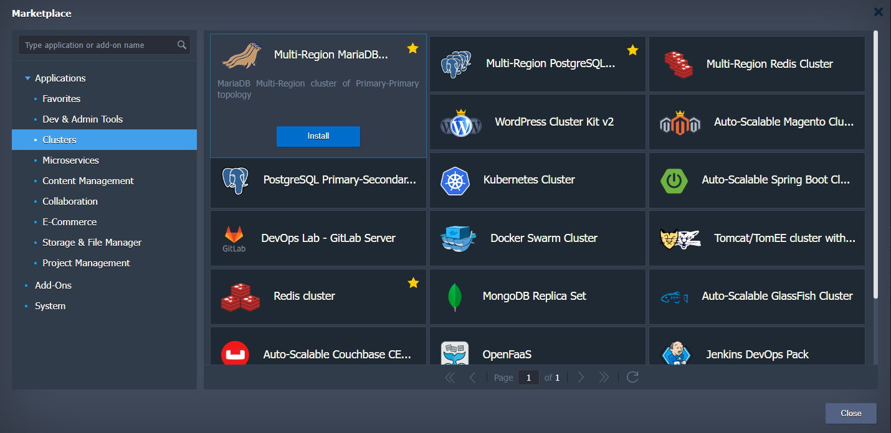
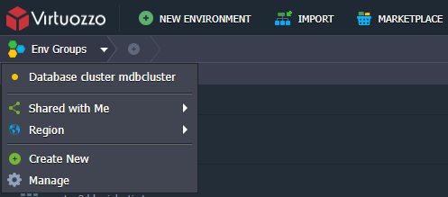
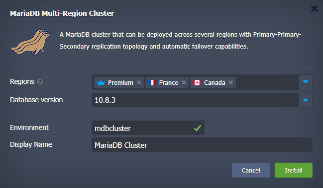
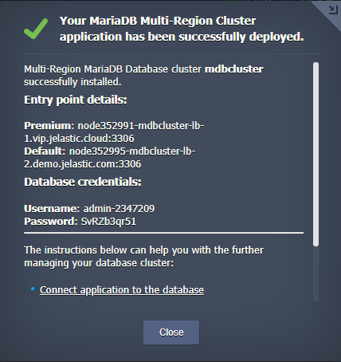
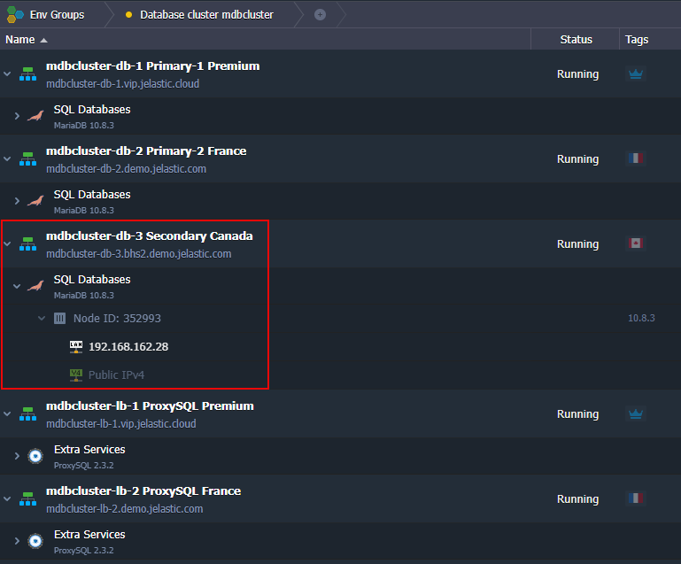

 

## MariaDB Automatic Сlustering Across Different Regions with Embedded Load Balancing, Automatic Failover and Disaster Recovery

MariaDB Multi-Region cluster is a solution that creates an advanced highly available cluster on top of managed Virtuozzo Application Platform dockerized stack templates. 

### Database topology
Multi-Region MariaDB clustering is based on [Primary-Primary](https://www.virtuozzo.com/application-platform-docs/auto-clustering/#mariadb) topology. With this topology an asynchronous replication ensures data spread across database cluster servers which fits better for the cases when Regions (Data centres) are located far away from each other. In such a way the latency influence on transaction commit can be compensated. As for disaster recovery one or more Secondary nodes can be added for the required Cross-Region deployment. Thus, the recommended topology may look like: Primary-Primary-Secondary in case there are three Regions available. Every database server or load balancer node in the cluster topology is created in a separate environment. After creation such environments are combined into Multi-Region cluster.

 

The package deployes Highly Available [ProxySQL Load Balancer](https://www.proxysql.com/) layer in front of the cluster in order to distribute requests between Primary nodes.

### High Availability and Failover

Main purpose of Cross-Region DB clusters is high availability and failover capabilities at the data centre level: database is accessible even if one of Regions becomes unavailable. Thus, if one of the Primary Region will fail, cluster will be available and keep handling Writes and Read queries. In case of both Primary Regions become unavailable the Secondary Region can be used to handle Reads and Writes with no data loss. Just update entry point setting in your database client application replacing ProxySQL hostnames with the hostname of database server located in Secondary Region.
Upon Cross-Region cluster, customer is able to select multiple Regions and select "Primary" Region that should host Primary servers and "Secondary" Region that should host Secondary database servers.

### Installation Process

Go to [VAP Marketplace](https://www.virtuozzo.com/application-platform-docs/marketplace/), find **Multi-Region MariaDB Cluster** application and run it. 

In the opened installation window specify the **Environment** name. This name will be used for Multi-Region environments isolation. For example, if you use **mdbcluster** name for the **Environment** field, all the cluster parts will be put into the **Database cluster mdbcluster** [environment group](https://www.virtuozzo.com/application-platform-docs/environment-groups/).

The order of region selection matters. 
Finally, click on **Install**. So, use tooltip to realize which region fits better for the Primary role and which ones for the Secondary role.

After successful installation, you’ll receive an email based on your environment topology with an entry point details and access credentials like in the successfull installation window.

### Entry Point

Entry point comprises two items one per each Primary node. Every item contains name of region and ProxySQL node hostname.
In case both Primary regions will fail use [hostname](https://www.virtuozzo.com/application-platform-docs/container-dns-hostnames/) or IP address of secondary node as an entry point.

